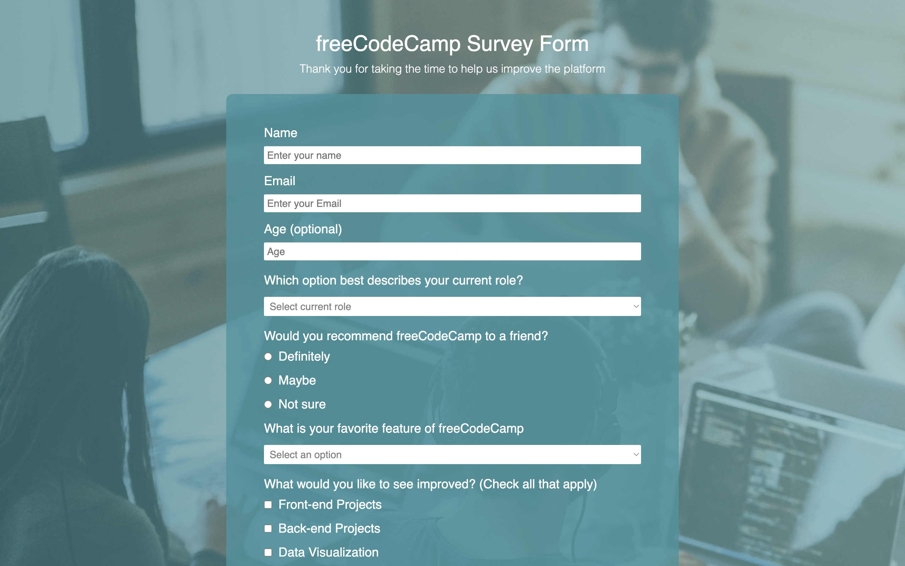

# Survey Form

Survey form to collect data from users to send suggestions to freeCodeCamp.

## Screenshots

## Demo

[Link](https://thepageguy.github.io/survey_form/)

## Author

- [@thepageguy](https://www.github.com/thepageguy)

## Acknowledgement

- [FreeCodeCamp](https://www.freecodecamp.org/)

## Tech Stack

**Languages:** HTML5 and CSS3

## Features

- Responsive

## Lessons Learned

- The basic of HTML and CSS
- The basic of HTML Forms

## Feedback

If you have any feedback, please reach out at thepageguy@mailfence.com.
